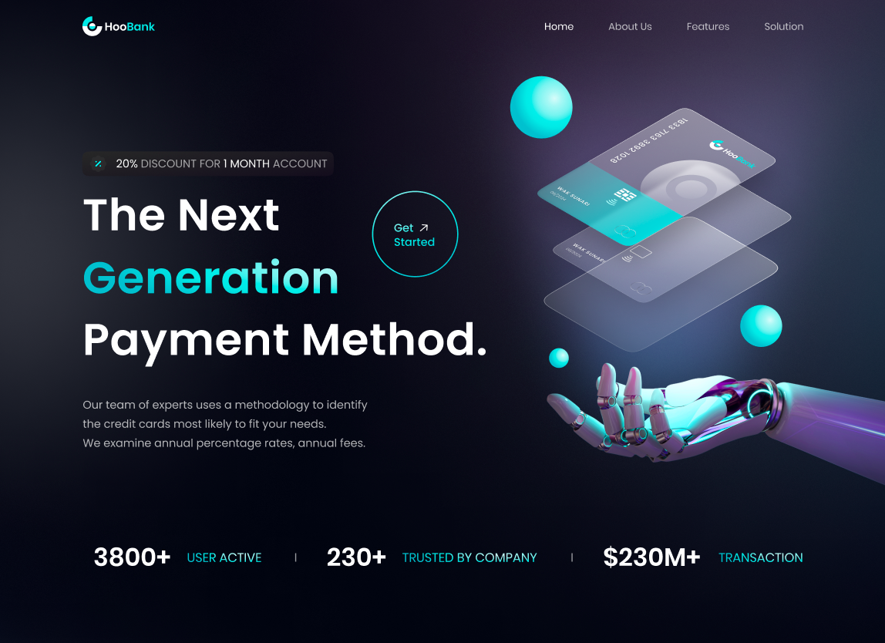

# Hoo-Bank

Transformed a Figma design into a responsive, fully functional landing page using React and Next.js to practice front-end development skills.
_It is the Next Generation Payment Method which mean that, you can now handle and control your money in easy way for Either for Business or for Controling Billing & Invoicing._

## Key highlights include

- **Modern, Interactive Design**: Delivers a seamless user experience for managing payments and financial services, with a visually appealing and engaging layout.
- **User-Friendly Interface**: Focused on accessibility and ease of use, designed with mobile-first principles for optimal responsiveness across all devices.
- **Dynamic and Reusable Components**: Built with modular React components for enhanced maintainability and scalability.
- **Organized Structure**: Adopts a clear folder organization for components, pages, assets, and styles, ensuring easy navigation and scalability.

## Technologies and tools

- HTML5
- CSS3
- JavaScript
- React
- Next.js
- Tailwindcss
- Figma

## Structure

- **app/**: Contains the main application files, including layout and global styles.
- **components/**: Contains reusable React components that make up the UI, such as headers, footers, and feature sections.
- **pages/**: Contains the different pages of the application, each representing a route in the app.
- **assets/**: Contains images, SVGs, and other static assets used throughout the application.
- **styles/**: Contains CSS files for styling the components and pages.
- **data/**: Contains data files that provide content for various components, such as business features and feedbacks.

## Sources & Reference

JavaScript Mastery:

- The figma design: https://www.figma.com/proto/RUVqx62xN2DAe7XSYriLf1?node-id=0-1&t=sApDso31voJZdAls-6
